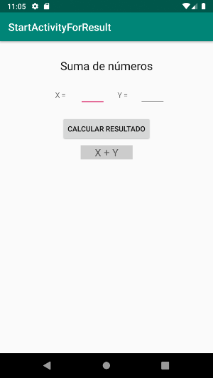

<h1>StartActivityForResult</h1>
En este ejercicio se muestra como crear una segunda actividad que devolverá 
un resultado a la actividad de la tarea que haya realizado. En este ejemplo tenemos una
primera actividad que pide dos números enteros al usuario. Cuando los datos
introducidos son correctos inicia una segunda actividad que realiza la suma
y devuelve el resultado a la primera actividad.
 
 

<h2>Otros conceptos</h2>

* Código "espaguetti"
* Salvar correctamente el estado de ambas actividades

